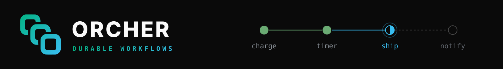

<p>
  <picture>
    <source media="(prefers-color-scheme: dark)" srcset="./assets/banner.svg">
    <source media="(prefers-color-scheme: light)" srcset="./assets/banner-light.svg">
    
  </picture>
</p>

<p align="center"><sub>Workflows that finish, even when the process running them doesn't.</sub></p>

<br />

ORCHER is a durable execution engine. You write workflows as ordinary async
code in Rust, TypeScript or Python. The engine records each step as it
completes, so a crash, a deploy or a restart resumes the run where it stopped
instead of starting it over, or losing it.

-  **Resumes, never restarts**: a dead worker's runs move to a live one and carry on from the last finished step
-  **Plain code**: decorators and macros on async functions, with no DSL and no YAML
-  **Durable timers and events**: sleep for days or wait on an outside signal, with nothing kept running
-  **Retries with intent**: per-task retry policies, and error types that are never retried
-  **Safe to change**: deterministic replay catches a workflow edited mid-run instead of silently diverging
-  **Written in Rust**: one small engine binary backed by Postgres

<br />

###  Try it in five minutes

```bash
git clone https://github.com/orcher-io/quickstart.git && cd quickstart
docker compose up -d --wait
```

Then run the example worker in the language you like, kill it halfway through
an order, and watch a new worker ship the order without charging it twice:

```rust
#[workflow(name = "order")]
async fn order(ctx: WorkflowContext, order_id: String) -> Result<String> {
    let charged: String = ctx.execute_task(charge, order_id.clone()).await?;
    ctx.sleep(Duration::from_secs(10)).await?; // kept by the engine, not the worker
    let shipped: String = ctx.execute_task(ship, order_id).await?;
    Ok(format!("{charged}, then {shipped}"))
}
```

<details>
<summary>Show in Python</summary>

```python
@workflow(name="order")
async def order(ctx: WorkflowContext, order_id: str) -> str:
    charged = await ctx.execute_task(charge, order_id=order_id)
    await ctx.sleep(timedelta(seconds=10))  # kept by the engine, not the worker
    shipped = await ctx.execute_task(ship, order_id=order_id)
    return f"{charged}, then {shipped}"
```

</details>

<details>
<summary>Show in TypeScript</summary>

```typescript
@Workflow({ name: 'order' })
export class Order {
  async run(ctx: WorkflowContext, orderId: string): Promise<string> {
    const charged = await ctx.executeTask(orderTasks.charge, orderId);
    await ctx.sleep(Duration.fromSeconds(10)); // kept by the engine, not the worker
    const shipped = await ctx.executeTask(orderTasks.ship, orderId);
    return `${charged}, then ${shipped}`;
  }
}
```

</details>

The full walkthrough is in [**orcher-io/quickstart**](https://github.com/orcher-io/quickstart).

<br />

###  SDKs

| | Install | Repository |
|---|---|---|
|  **Rust** | `cargo add orcher-sdk` | [sdk-rust](https://github.com/orcher-io/sdk-rust) <a href="https://crates.io/crates/orcher-sdk"></a> |
|  **TypeScript** | `npm install @orcher/sdk` | [sdk-ts](https://github.com/orcher-io/sdk-ts) <a href="https://www.npmjs.com/package/@orcher/sdk"></a> |
|  **Python** | `pip install orcher-sdk` | [sdk-py](https://github.com/orcher-io/sdk-py) <a href="https://pypi.org/project/orcher-sdk/"></a> |

All three are built on [**sdk-core**](https://github.com/orcher-io/sdk-core),
a shared Rust core that handles the connection, the workers and replay, so the
SDKs behave the same. The wire protocol is in [**protos**](https://github.com/orcher-io/protos).

<br />

###  Status

ORCHER is in **developer preview**. The SDKs, the core and the protocol are
open source under Apache-2.0. The engine is free to download as a container
image, `ghcr.io/orcher-io/orcher`, for development and evaluation; production
use needs permission while the preview lasts. APIs may change between minor
releases until 1.0, and every change is listed in each repository's changelog.

<br />

###  Get involved

- Questions and ideas: [Discussions](https://github.com/orcher-io/quickstart/discussions)
- Bugs and feature requests: open an issue in the repository it concerns
- Security reports: privately, as described in our [security policy](https://github.com/orcher-io/.github/blob/main/SECURITY.md)
- News: join the list at [orcher.io](https://orcher.io)

<sub>Rust, TypeScript and Python logos are trademarks of their respective owners, shown to indicate the languages each SDK is for.</sub>
